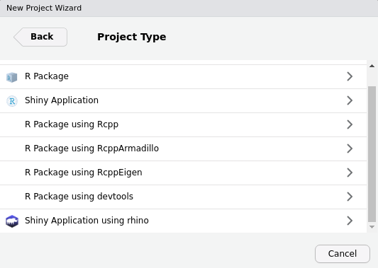
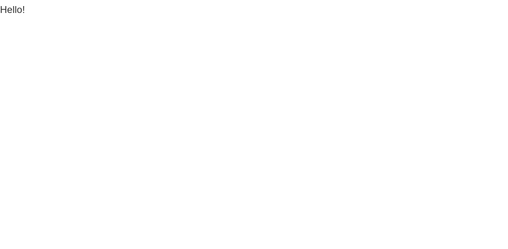
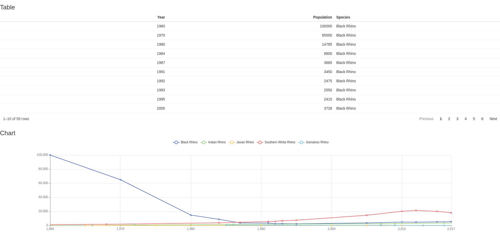
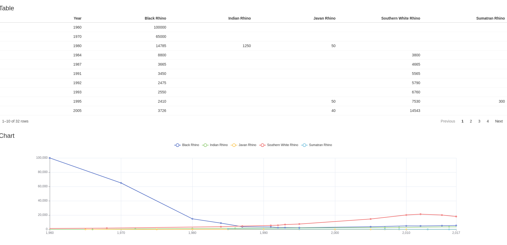
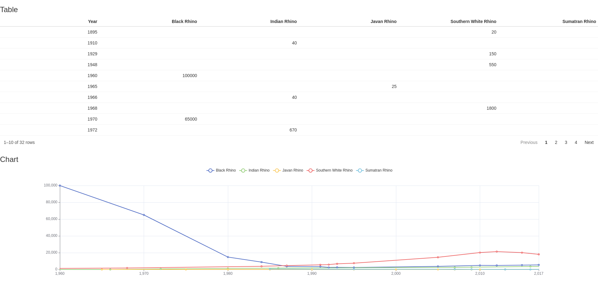
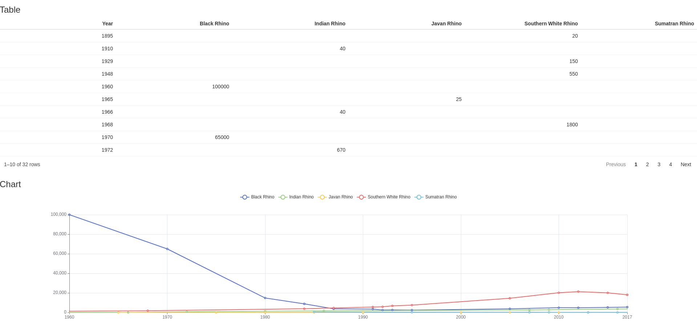

# Setup

## How to install Rhino?

To get started, the first thing you will need is to install Rhino
itself:

    install.packages("rhino")

## Dependencies

This tutorial uses the native pipe operator (`|>`) introduced in R 4.1
release. If you use an earlier R version, then you can use the `%>%`
pipe operator found in `{magrittr}` and `{dplyr}` packages instead.\*

Development tools for JavaScript and Sass, provided by Rhino, require
[Node.js](https://nodejs.org/en/) and [yarn](https://yarnpkg.com/).
Please follow installation guides for your OS:

-   [Node.js installation guide](https://nodejs.org/en/download/)
-   [yarn installation
    guide](https://yarnpkg.com/getting-started/install)

Don’t be discouraged if you are not able to get Node.js and yarn on your
machine. Rhino will still work for you (with some small limitations
described in [JavaScript](#add-javascript-code) and
[Sass](#add-custom-styles) sections).

**Note:** *If you already have node installed on your machine, make sure
that you are using version &gt;=12.0.0.*

------------------------------------------------------------------------

# Create an initial application

Creating a new Rhino application can be done in two ways - by running
`rhino::init()` function or by using the RStudio Create Project
functionality.

## Create an application using the RStudio wizard

If you use RStudio, probably the easiest way to create a new Rhino
application is to simply use Create New Project feature. Once Rhino is
installed, it will be automatically added as one of the options in
RStudio:

Choose it, input the new project name and you are ready to go.

## Create an application using `rhino::init()`

Creating a Rhino application is possible in the R console by running the
`init` function:

    rhino::init("RhinoApplication")

There are two things you need to know when choosing this way of
initializing your application:

1.  Rhino will **not** change your working directory. You need to either
    open a new R session in your new application directory or manually
    change the working directory.

<!-- -->

    setwd("./RhinoApplication")

1.  Rhino relies on options added to the projects `.Rprofile` file. The
    most robust way to make sure it was correctly sourced is to simply
    restart the R session.

------------------------------------------------------------------------

A result of both paths will be an initial Rhino application with the
following structure:

    .
    ├── app
    │   ├── js
    │   │   └── index.js
    │   ├── logic
    │   │   └── __init__.R
    │   ├── static
    │   │   └── favicon.ico
    │   ├── styles
    │   │   └── main.scss
    │   ├── view
    │   │   └── __init__.R
    │   └── main.R
    ├── tests
    │   ├── cypress
    │   │   └── integration
    │   │       └── app.spec.js
    │   ├── testthat
    │   │   └── test-main.R
    │   └── cypress.json
    ├── app.R
    ├── RhinoApplication.Rproj
    ├── dependencies.R
    ├── renv.lock
    └── rhino.yml

If you want to know more about it, check
[this](https://appsilon.github.io/rhino/articles/explanation/application-structure.html)
document.

## Running the application

Now, once you are all set up, let’s run it:

    shiny::shinyAppDir(".")

And here is what you should be seeing right now:

# Add your first module

Your application runs, but it doesn’t have any meaningful functionality.
Let’s add something there!

## Module structure

In Rhino, each application view is intended to live as a [Shiny
module](https://shiny.rstudio.com/articles/modules.html) and use
encapsulation provided by [`box` package](https://klmr.me/box/).

Rhino already created a good place for new modules, the `app/view`
directory. Create a file there, named `chart.R`:

    # app/view/chart.R

    box::use(
      shiny[moduleServer, NS, h3]
    )

    #' @export
    ui <- function(id) {
      ns <- NS(id)

      h3("Chart")
    }

    #' @export
    server <- function(id) {
      moduleServer(id, function(input, output, session) {
        print("Chart module server part works!")
      })
    }

## Calling a module

The next step is to call your new module in your application. First, you
need to import it into your main application file. To do that, add
another `box::use` section in your `app/main.R` file:

    # app/main.R

    box::use(
      app/view/chart
    )

    ...

Now, the main module will be able to use exported functions from
`chart.R`. Let’s try it! Modify your `app/main.R` file to look like
that:

    # app/main.R

    box::use(
      shiny[bootstrapPage, moduleServer, NS],
    )

    box::use(
      app/view/chart
    )

    #' @export
    ui <- function(id) {
      ns <- NS(id)

      bootstrapPage(
        chart$ui(ns("chart"))
      )
    }

    #' @export
    server <- function(id) {
      moduleServer(id, function(input, output, session) {
        chart$server("chart")
      })
    }

Now, when you run your application, you should see the message from the
newly created module:

## Adding components to a module

Now is the time to start adding something to your new module. What can
we add to a “chart” module? You’re right, a chart. Let’s add a chart
with a rhinoceros dataset available in Rhino.

### Adding R packages

First, we need to install a library for visualizations - for that, we
will go with [`echarts4r`](https://echarts4r.john-coene.com/).

Rhino relies on the [`renv`
package](https://rstudio.github.io/renv/index.html) for dependency
management. To add this package to your project, first, you need to
install it. We will be using a total of 5 packages for this application.
To save us time in the tutorial we will install them all here. Please
note that for every new package you add, you will need to install, add
to dependencies.R, and re-run renv::snapshot().

    # In R console
    renv::install("echarts4r")
    renv::install("reactable")
    renv::install("tidyr")
    renv::install("dplyr")
    renv::install("htmlwidgets")

**Note:** *Package `htmlwidgets` is already installed since it is a
dependency for `shiny`, but we still should add it to the
`dependencies.R` file:*

The second step is to add them to the `dependencies.R` file. This file
is a single source of truth when it comes to R packages used by the
application. `renv` is going to check dependencies only in this file.

Add `library` calls to it:

    # dependencies.R

    # This file allows packrat (used by rsconnect during deployment) to pick up dependencies.
    library(rhino)
    library(echarts4r)
    library(reactable)
    library(tidyr)
    library(dplyr)
    library(htmlwidgets)

Finally, you need to update your `renv.lock` file:

    # in R console
    renv::snapshot()

If you check the `renv.lock` file, you will see that it was updated with
`echarts4r` and all its dependencies.

### Add dependencies to the module

Now, once you have both packages available in your project environment,
it’s time to use them. First, you need to import them into your module.
Extend `box::use` call in your `app/view/chart.R` file:

    # app/view/chart.R

    box::use(
      shiny[moduleServer, NS, h3, tagList],
      echarts4r,
    )

    ...

You can use those packages in your module by calling
`{package}${function}`. For more options of importing in `box` check
[this](https://klmr.me/box/index.html#loading-code) link.

Add `echarts4r` render to the server part of the module and output part
to its UI:

    # app/view/chart.R

    box::use(
      shiny[moduleServer, NS, h3, tagList],
      echarts4r,
    )

    #' @export
    ui <- function(id) {
      ns <- NS(id)

      tagList(
        h3("Chart"),
        echarts4r$echarts4rOutput(ns("chart"))
      )
    }

    #' @export
    server <- function(id) {
      moduleServer(id, function(input, output, session) {
        output$chart <- echarts4r$renderEcharts4r(
          # Datasets are the only case when you need to use :: in `box`.
          # This issue should be solved in the next `box` release.
          rhino::rhinos |>
            echarts4r$group_by(Species) |>
            echarts4r$e_chart(x = Year) |>
            echarts4r$e_line(Population) |>
            echarts4r$e_x_axis(Year) |>
            echarts4r$e_tooltip()
        )
      })
    }

One thing worth noting here is that in the UI part we had to use another
function from Shiny - `tagList`. To be able to do that, you have to
adjust your import in `box::use` - simply add `tagList` to the list of
imported functions.

------------------------------------------------------------------------

Finally, when you run your application, you should see something similar
to this:

# Add a second module

Once you have some content presented in the application, it would be
great to add a table to show the dataset.

For that, let’s create another module - `app/view/table.R`:

    # app/view/table.R

    box::use(
      shiny[moduleServer, NS, h3, tagList],
    )

    #' @export
    ui <- function(id) {
      ns <- NS(id)

      tagList(
        h3("Table")
      )
    }

    #' @export
    server <- function(id) {
      moduleServer(id, function(input, output, session) {

      })
    }

## Calling the second module

As we did before, we need to call the new module in the `main.R` file:

    # app/main.R

    box::use(
      shiny[bootstrapPage, moduleServer, NS],
    )

    box::use(
      app/view/chart,
      app/view/table
    )

    #' @export
    ui <- function(id) {
      ns <- NS(id)

      bootstrapPage(
        table$ui(ns("table")),
        chart$ui(ns("chart"))
      )
    }

    #' @export
    server <- function(id) {
      moduleServer(id, function(input, output, session) {
        table$server("table")
        chart$server("chart")
      })
    }

## Use the same dataset for both modules

We want to use the same dataset in both modules, so instead of calling
it twice, let’s pass data as an argument:

    # app/main.R

    box::use(
      shiny[bootstrapPage, moduleServer, NS]
    )

    box::use(
      app/view/table,
      app/view/chart,
    )

    #' @export
    ui <- function(id) {
      ns <- NS(id)

      bootstrapPage(
        table$ui(ns("table")),
        chart$ui(ns("chart"))
      )
    }

    #' @export
    server <- function(id) {
      moduleServer(id, function(input, output, session) {
        # Datasets are the only case when you need to use :: in `box`.
        # This issue should be solved in the next `box` release.
        data <- rhino::rhinos

        table$server("table", data = data)
        chart$server("chart", data = data)
      })
    }

    # app/view/table.R

    box::use(
      shiny[moduleServer, NS, h3, tagList],
    )

    #' @export
    ui <- function(id) {
      ns <- NS(id)

      tagList(
        h3("Table")
      )
    }

    #' @export
    server <- function(id, data) {
      moduleServer(id, function(input, output, session) {

      })
    }

    # app/view/chart.R

    box::use(
      shiny[moduleServer, NS, h3, tagList],
      echarts4r
    )

    #' @export
    ui <- function(id) {
      ns <- NS(id)

      tagList(
        h3("Chart"),
        echarts4r$echarts4rOutput(ns("chart"))
      )
    }

    #' @export
    server <- function(id, data) {
      moduleServer(id, function(input, output, session) {
        output$chart <- echarts4r$renderEcharts4r(
          data |>
            echarts4r$group_by(Species) |>
            echarts4r$e_chart(x = Year) |>
            echarts4r$e_line(Population) |>
            echarts4r$e_x_axis(Year) |>
            echarts4r$e_tooltip()
        )
      })
    }

## Create a table

For the table, we will go with the
[`reactable`](https://glin.github.io/reactable/) package.

Now you can add a table to the application. Let’s check the raw data for
Rhinos:

    # app/view/table.R

    box::use(
      shiny[moduleServer, NS, h3, tagList],
      reactable,
    )

    #' @export
    ui <- function(id) {
      ns <- NS(id)

      tagList(
        h3("Table"),
        reactable$reactableOutput(ns("table"))
      )
    }

    #' @export
    server <- function(id, data) {
      moduleServer(id, function(input, output, session) {
        output$table <- reactable$renderReactable(
          reactable$reactable(data)
        )
      })
    }

The application should look similar to this:

# Add logic

It seems that it would be great to slightly adjust the table. Let’s
transform the dataset a little bit.

We recommend placing the code which can be expressed without Shiny in
the `app/logic` directory.

Let’s create a file there, called `app/logic/data_transformation.R`.

The table would be better if for each Rhino species we would have a
separate column, so it would be easy to compare populations across time.
To do that, we need to transform the dataset using the `pivot_wider`
function from the `tidyr` package.

Now we are able to access this function in our `data_transformation.R`
file using box::use(). Let’s also create a function that wraps
`pivot_wider` and transforms data. Note that, as always, we need to add
@export to be able to access it in the file it is being sourced.

    # app/logic/data_transformation.R

    box::use(
      tidyr[pivot_wider]
    )

    #' @export
    transform_data <- function(data) {
      pivot_wider(
        data = data,
        names_from = Species,
        values_from = Population
      )
    }

The next step is to call this function in your table module.

Add box import and transform dataset:

    # app/view/table.R

    box::use(
      shiny[moduleServer, NS, h3, tagList],
      reactable,
    )

    box::use(
      app/logic/data_transformation[transform_data]
    )

    #' @export
    ui <- function(id) {
      ns <- NS(id)

      tagList(
        h3("Table"),
        reactable$reactableOutput(ns("table"))
      )
    }

    #' @export
    server <- function(id, data) {
      moduleServer(id, function(input, output, session) {
        output$table <- reactable$renderReactable(
          data |>
            transform_data() |>
            reactable$reactable()
        )
      })
    }

When you run the application, you should see something similar to this:

You can notice, that table is arranged by the Black Rhino population. It
would make sense to change it to Year using `dplyr::arrange`.

Next, add arrange to `transform_data` function:

    # app/logic/data_transformation.R

    box::use(
      tidyr[pivot_wider],
      dplyr[arrange]
    )

    #' @export
    transform_data <- function(data) {
      pivot_wider(
        data = data,
        names_from = Species,
        values_from = Population
      ) |>
        arrange(Year)
    }

The result looks much more understandable:

There is still one element that can be improved. If you check the X-axis
in the chart, values contain a comma. It’s the default behavior for
integers, but this is a year! To fix that, you need to add a custom
formatter. Let’s create another file, `app/logic/chart_utils.R`:

    # app/logic/chart_utils.R

    box::use(
      htmlwidgets[JS]
    )

    #' @export
    label_formatter <- JS(
      "function(value, index){
        return value;
      }"
    )

Finally, add the formatter to the chart module:

    # app/view/chart.R

    box::use(
      shiny[moduleServer, NS, h3, tagList],
      echarts4r
    )

    box::use(
      app/logic/chart_utils[label_formatter]
    )

    #' @export
    ui <- function(id) {
      ns <- NS(id)

      tagList(
        h3("Chart"),
        echarts4r$echarts4rOutput(ns("chart"))
      )
    }

    #' @export
    server <- function(id, data) {
      moduleServer(id, function(input, output, session) {
        output$chart <- echarts4r$renderEcharts4r(
          data |>
            echarts4r$group_by(Species) |>
            echarts4r$e_chart(x = Year) |>
            echarts4r$e_line(Population) |>
            echarts4r$e_x_axis(
              Year,
              axisLabel = list(
                formatter = label_formatter
              )
            ) |>
            echarts4r$e_tooltip()
        )
      })
    }

It should now look better:

# Add custom styles

**Note:** *Sass builder uses Node.js. If you are not able to install
Node in your environment, you can change the `sass` entry in the
`rhino.yml` file to `r`. It will now use the R package for Sass
bundling. Under the hood, it uses a deprecated C++ library, so the Node
solution is strongly recommended here.*

In this stage, the application has working components, but it doesn’t
have a clean and organized look to it. For this we will need a little
css styling.

Adjusting application style can be done by providing custom styles in
the `app/styles` directory, But first, you need to adjust the
application a little bit by adding Html tags and CSS classes:

    # app/main.R

    box::use(
      shiny[bootstrapPage, moduleServer, NS, div],
    )

    box::use(
      app/view/table,
      app/view/chart,
    )

    #' @export
    ui <- function(id) {
      ns <- NS(id)

      bootstrapPage(
        div(
          class = "components-container",
          table$ui(ns("table")),
          chart$ui(ns("chart"))
        )
      )
    }

    #' @export
    server <- function(id) {
      moduleServer(id, function(input, output, session) {
        # Datasets are the only case when you need to use :: in `box`.
        # This issue should be solved in the next `box` release.
        data <- rhino::rhinos

        table$server("table", data = data)
        chart$server("chart", data = data)
      })
    }

    # app/view/chart.R

    box::use(
      shiny[moduleServer, NS, div],
      echarts4r
    )

    box::use(
      app/logic/chart_utils[label_formatter]
    )

    #' @export
    ui <- function(id) {
      ns <- NS(id)

      div(
        class = "component-box",
        echarts4r$echarts4rOutput(ns("chart"))
      )
    }

    #' @export
    server <- function(id, data) {
      moduleServer(id, function(input, output, session) {
        output$chart <- echarts4r$renderEcharts4r(
          data |>
            echarts4r$group_by(Species) |>
            echarts4r$e_chart(x = Year) |>
            echarts4r$e_line(Population) |>
            echarts4r$e_x_axis(
              Year,
              axisLabel = list(
                formatter = label_formatter
              )
            ) |>
            echarts4r$e_tooltip()
        )
      })
    }

    # app/view/table.R

    box::use(
      shiny[moduleServer, NS, div],
      reactable,
    )

    box::use(
      app/logic/data_transformation[transform_data]
    )

    #' @export
    ui <- function(id) {
      ns <- NS(id)

      div(
        class = "component-box",
        reactable$reactableOutput(ns("table"))
      )
    }

    #' @export
    server <- function(id, data) {
      moduleServer(id, function(input, output, session) {
        output$table <- reactable$renderReactable(
          data |>
            transform_data() |>
            reactable$reactable()
        )
      })
    }

Now you are ready to modify the styles. Simply add few CSS rules to
`app/styles/mains.scss` file:

    // app/styles/main.scss

    .components-container {
      display: inline-grid;
      grid-template-columns: 1fr 1fr;
      width: 100%;

      .component-box {
        padding: 10px;
        margin: 10px;
        box-shadow: 0 4px 8px 0 rgba(0, 0, 0, 0.2), 0 6px 20px 0 rgba(0, 0, 0, 0.19);
      }
    }

If you try running the application right now, you will not see any
changes. That is because Rhino uses minified `app/static/app.min.css`
for styling. To use it, you will need to build it using the Rhino
function:

    # in R console
    rhino::build_sass()

Now, after running the application you should see something similar to
this:

It is worth noting, that you don’t need to add `app/static/app.min.css`
to your application header - Rhino does that for you.

Let’s adjust the application a little bit more by adding a title:

    # app/main.R

    box::use(
      shiny[bootstrapPage, moduleServer, NS, div, h1],
    )

    box::use(
      app/view/table,
      app/view/chart,
    )

    #' @export
    ui <- function(id) {
      ns <- NS(id)

      bootstrapPage(
        h1("RhinoApplication"),
        div(
          class = "components-container",
          table$ui(ns("table")),
          chart$ui(ns("chart"))
        )
      )
    }

    ...

And some styling:

    // app/styles/main.scss

    .components-container {
      display: inline-grid;
      grid-template-columns: 1fr 1fr;
      width: 100%;

      .component-box {
        padding: 10px;
        margin: 10px;
        box-shadow: 0 4px 8px 0 rgba(0, 0, 0, 0.2), 0 6px 20px 0 rgba(0, 0, 0, 0.19);
      }
    }

    h1 {
      text-align: center;
      font-weight: 900;
    }

Finally, build Sass once again:

    # in R console
    rhino::build_sass()

The result should look similar to this:

# Add JavaScript code

------------------------------------------------------------------------

**Note:** *Rhino tools for JS require Node.js. You can still use
JavaScript code [like in a regular Shiny
application](https://shiny.rstudio.com/articles/packaging-javascript.html),
but instead of using `www` directory, you should add your files to
`static/js` and call them using full path,
e.g. `tags$script(src = "static/js/app.min.js")`.*

------------------------------------------------------------------------

As the last element, let’s add a button that will trigger a JavaScript
popup.

First, we need to create a simple button and style it:

    # app/main.R

    box::use(
      shiny[bootstrapPage, moduleServer, NS, div, h1, tags, icon],
    )

    box::use(
      app/view/table,
      app/view/chart,
    )

    #' @export
    ui <- function(id) {
      ns <- NS(id)

      bootstrapPage(
        h1("RhinoApplication"),
        div(
          class = "components-container",
          table$ui(ns("table")),
          chart$ui(ns("chart"))
        ),
        tags$button(
          id = "help-button",
          icon("question")
        )
      )
    }

    ...

    // app/styles/main.scss

    .components-container {
      display: inline-grid;
      grid-template-columns: 1fr 1fr;
      width: 100%;

      .component-box {
        padding: 10px;
        margin: 10px;
        box-shadow: 0 4px 8px 0 rgba(0, 0, 0, 0.2), 0 6px 20px 0 rgba(0, 0, 0, 0.19);
      }
    }

    h1 {
      text-align: center;
      font-weight: 900;
    }

    #help-button {
      position: fixed;
      top: 0;
      right: 0;
      margin: 10px;
    }

Remember to rebuild Sass with `rhino::build_sass()`!

You should now see a button with a question mark in the top right corner
of the application:

Now, it’s time for writing the JavaScript code that should show the
popup with a message. All JS code should be stored in the `app/js`
directory. You already have the first (empty) file there - `index.js`.
Let’s use it:

    // app/js/index.js

    export function showHelp() {
      alert("Check rhino here: https://appsilon.github.io/rhino/");
    }

This function will simply show a browser alert with the message. If you
are familiar with how JavaScript code is used in Shiny applications, you
will notice one difference - keyword `export` added before the function
name. In Rhino, only functions marked like that will be available for
Shiny to use.

Same as it was with styles, the Rhino application does not use JS files
directly, but instead utilizes minified version build with
`rhino::build_js` function. Try it:

    # in R console
    rhino::build_js()

Now `app/static/js/app.min.js` file has been created and, same as the
minified CSS file, is automatically included in the application head
tag.

The last thing here is to use the `showHelp()` function in the
application. To do that, let’s simply add `onclick` to the button:

    # app/main.R

    box::use(
      shiny[bootstrapPage, moduleServer, NS, div, h1, tags, icon],
    )

    box::use(
      app/view/table,
      app/view/chart,
    )

    #' @export
    ui <- function(id) {
      ns <- NS(id)

      bootstrapPage(
        h1("RhinoApplication"),
        div(
          class = "components-container",
          table$ui(ns("table")),
          chart$ui(ns("chart"))
        ),
        tags$button(
          id = "help-button",
          icon("question"),
          onclick = "App.showHelp()"
        )
      )
    }

    ...

You have probably noticed the second difference between the classic
Shiny approach and the one used in Rhino. All exported JS functions are
now available under `App` (same as any other JavaScript function from a
library, e.g. `Math.round`).

Now, if you run the application and click the button, you should see
something like this:

------------------------------------------------------------------------

**Congratulations! You now have a fully armed and operational <s>battle
station</s> Rhino application!**

